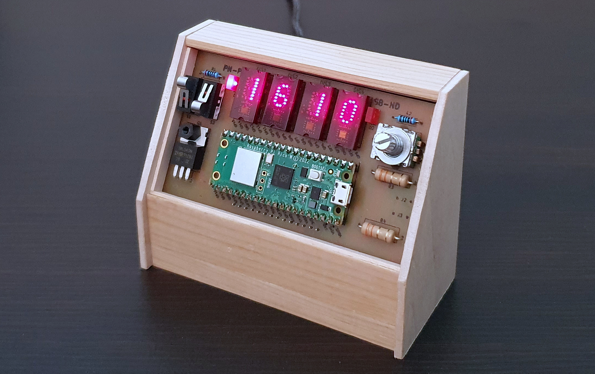

Alarm Clock with Oversleep Prevention
=====================================

Features:

- automatic time synchronization with NTP server over WiFi
- old-style TIL311 hexadecimal display
- two alarm settings: for weekdays and for weekends
- alarm starts gently with some nature sounds for a couple of minutes
- alarm ends with very loud energetic music to make sure you hear it
- to turn alarm off you need to read three random numbers and enter them back
- this makes sure that you are fully awake and do not oversleep the alarm

There is no documentation for this project, as this is rather for my own purposes.
Feel free to reverse-engineer it.

    

